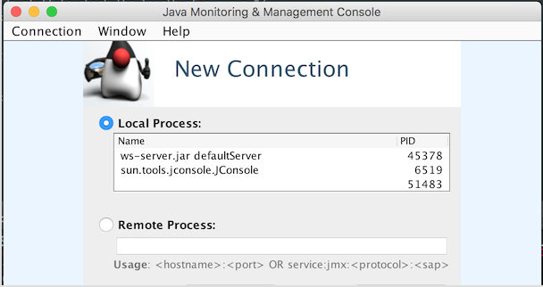
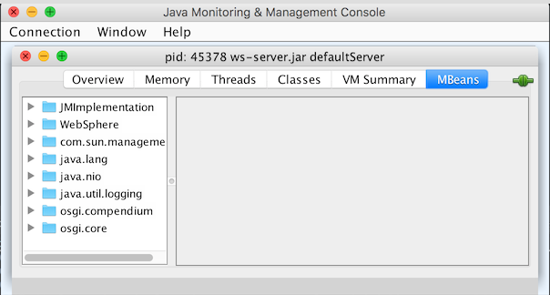
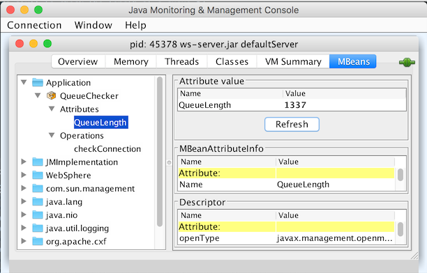

# MXBean-Example

### Description
This is an example application that exposes an simple MXBean. Nothing fancy.

### Walkthrough

- The Java EE application server starts and starts the Singleton EJB.

- The singletons init function creates an MXBean and registers it with the JVM's MBean server as Application:name=QueueChecker.

```java
MBeanServer server = ManagementFactory.getPlatformMBeanServer();

SuperFancyBeanAppHealth ah = new SuperFancyBeanAppHealth();

ObjectName ahObjName = new ObjectName ("Application:name=QueueChecker");
server.registerMBean(ah, ahObjName);
```

The SuperFancyBeanAppHealth MXBean looks like this:
```java
public class SuperFancyBeanAppHealth implements QueueMXBean {

	@Override
	public int getQueueLength() {
		/* do stuff to check the length of a queue */
		return 1337;
	}

	@Override
	public boolean checkConnection() {
		/* do stuff to check that the connection is working */
		return false;
}
```

### Tests

To test the MXBean the JConsole is an excellent tool.

Fire it up and connect to the local process.



Navigate to MBeans.

Our EJB's startup has not finished just yet. Our MXBean has not been registered with the MBEan Server.



Our MXbean has now been registered and we can browse the attributes and execute operations.

  


  ### More information
  Check out these, more in-depth resources with more advanced examples.

- https://docs.oracle.com/javase/tutorial/jmx/mbeans/mxbeans.html
- https://docs.oracle.com/javase/7/docs/api/javax/management/MXBean.html
